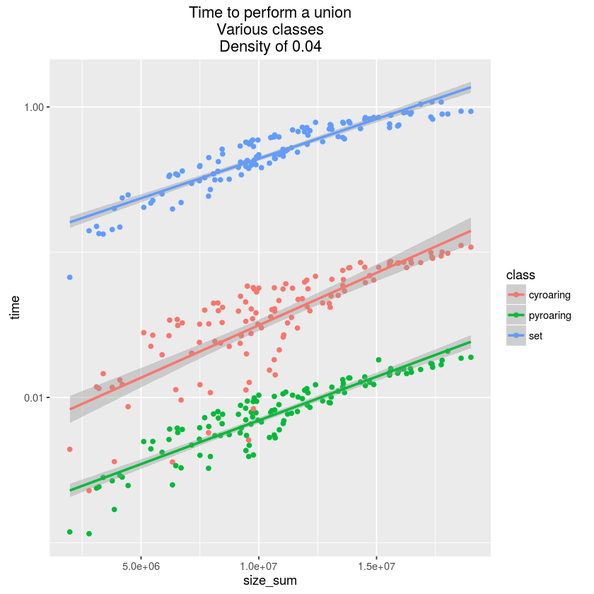
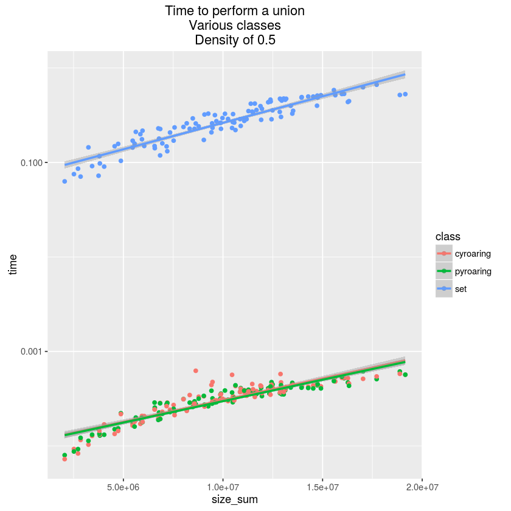
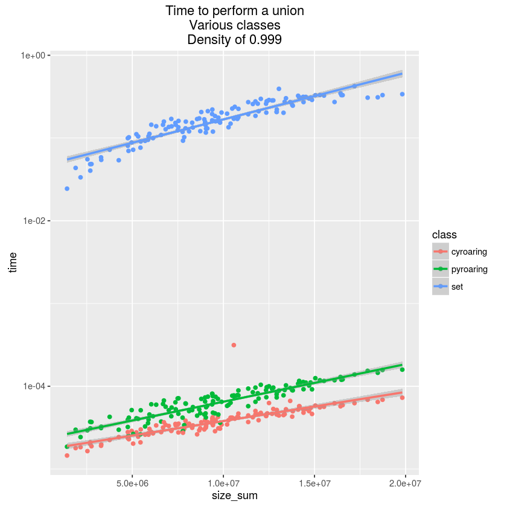

|Build Status|
|Documentation Status|

An efficient and light-weight ordered set of 32 bits integers.
This is a Python wrapper for the C library `CRoaring <https://github.com/RoaringBitmap/CRoaring>`__.

The wrapping used to be done with ``Ctypes``. We recently switched to
``Cython`` for the following reasons:

-  Much better performances for short function calls (e.g.
   addition/deletion of a single element).
-  Easier installation, no need to install manually the C library, it is
   now distributed with PyRoaring.
-  Extensibility, it will be easier to write efficient codes with Cython
   (e.g. some data structures based on roaring bitmaps).

If for some reason you wish to keep using the old version, based on
``Ctypes``, use `PyRoaring
0.0.7 <https://github.com/Ezibenroc/PyRoaringBitMap/tree/0.0.7>`__.

Requirements
------------

-  Environment like Linux and MacOS
-  Python 2.7, or Python 3.3 or better
-  A recent C compiler like GCC
-  The package manager ``pip``
-  The Python package ``hypothesis`` (optional, for testing)
-  The Python package ``Cython`` (optional, for compiling pyroaring from
   the sources)
-  The Python package ``wheel`` (optional, to build a wheel for the library)

Installation
------------

To install pyroaring on your local account, use the following command:

.. code:: bash

    pip install pyroaring --user # installs PyRoaringBitMap

For a system-wide installation, use the following command:

.. code:: bash

    pip install pyroaring

Naturally, the latter may require superuser rights (consider prefixing
the commands by ``sudo``).

If you want to use Python 3 and your system defaults on Python 2.7, you
may need to adjust the above commands, e.g., replace ``pip`` by ``pip3``.

Manual compilation / installation
---------------------------------

If you want to compile (and install) pyroaring by yourself, for instance
to modify the Cython sources or because you do not have ``pip``, follow
these steps. Note that the Python package ``Cython`` is required.

Clone this repository.

.. code:: bash

    git clone https://github.com/Ezibenroc/PyRoaringBitMap.git
    cd PyRoaringBitMap

Build pyroaring locally, e.g. to test a new feature you made.

.. code:: bash

    python setup.py build_ext -i
    python test.py # run the tests, optionnal but recommended

Install pyroaring (use this if you do not have ``pip``).

.. code:: bash

    python setup.py install # may require superuser rights, add option --user if you wish to install it on your local account 

Package pyroaring.

.. code:: bash

    python setup.py sdist
    pip install dist/pyroaring-0.1.?.tar.gz # optionnal, to install the package

Build a wheel.

.. code:: bash

    python setup.py bdist_wheel

For all the above commands, two environment variables can be used to control the compilation.

- ``DEBUG=1`` to build pyroaring in debug mode.
- ``ARCHI=<cpu-type>`` to build pyroaring for the given platform. The platform may be any keyword
  given to the ``-march`` option of gcc (see the
  `documentation <https://gcc.gnu.org/onlinedocs/gcc-4.5.3/gcc/i386-and-x86_002d64-Options.html>`__).
  Note that cross-compiling for a 32-bit architecture from a 64-bit architecture is not supported.

Example of use:

.. code:: bash

    DEBUG=1 ARCHI=x86-64 python setup.py build_ext

Utilization
-----------

First, you can run the tests to make sure everything is ok:

.. code:: bash

    pip install hypothesis --user
    python test.py

You can use a bitmap nearly as the classical Python set in your code:

.. code:: python

    from pyroaring import BitMap
    bm1 = BitMap()
    bm1.add(3)
    bm1.add(18)
    bm2 = BitMap([3, 27, 42])
    print("bm1       = %s" % bm1)
    print("bm2       = %s" % bm2)
    print("bm1 & bm2 = %s" % (bm1&bm2))
    print("bm1 | bm2 = %s" % (bm1|bm2))

Output:

::

    bm1       = BitMap([3, 18])
    bm2       = BitMap([3, 27, 42])
    bm1 & bm2 = BitMap([3])
    bm1 | bm2 = BitMap([3, 18, 27, 42])

Benchmark
---------

The built-in ``set`` is compared with ``pyroaring``, a
`Cython implementation <https://github.com/andreasvc/roaringbitmap>`__
of Roaring bitmaps called ``roaringbitmap``, and a Python implemenntation
of `ordered sets <https://github.com/grantjenks/sorted_containers>`__
called ``sortedcontainers``.

Quick benchmarks for common operations
~~~~~~~~~~~~~~~~~~~~~~~~~~~~~~~~~~~~~~

The script ``quick_bench.py`` measures the time of different set
operations. It uses randomly generated sets of size 1e6 and density
0.125. For each operation, the average time (in seconds) of 30 tests
is reported.

The results have been obtained with:

- CPython version 3.5.2
- pyroaring commit `2ccc0bf6e428d771061499440bcde0ca0fa2a946`
- roaringbitmap commit `95ca18f902389464d15732d35de7be868d660ed2`
- sortedcontainers version 1.5.7

===============================  ===========  ===============  ==========  ==================
operation                          pyroaring    roaringbitmap         set    sortedcontainers
===============================  ===========  ===============  ==========  ==================
range constructor                   1.39e-04         1.35e-04    5.41e-02            1.85e-01
ordered list constructor            3.27e-02         1.61e-01    1.64e-01            5.09e-01
list constructor                    1.23e-01         1.55e-01    9.76e-02            4.64e-01
ordered array constructor           3.69e-03         2.81e-01    8.10e-02            2.83e-01
array constructor                   1.17e-01         4.95e-01    1.47e-01            4.97e-01
element addition                    1.79e-07         1.77e-07    1.39e-07            9.39e-07
element removal                     1.81e-07         1.73e-07    1.27e-07            3.09e-07
membership test                     8.99e-08         1.15e-07    9.50e-08            4.23e-07
union                               1.80e-04         1.61e-04    1.47e-01            9.15e-01
intersection                        8.99e-04         9.12e-04    4.61e-02            1.45e-01
difference                          1.92e-04         1.60e-04    1.26e-01            4.24e-01
symmetric diference                 1.81e-04         1.60e-04    1.81e-01            7.71e-01
equality test                       7.99e-05         6.40e-05    1.93e-02            1.86e-02
subset test                         8.22e-05         8.26e-05    1.84e-02            1.83e-02
conversion to list                  4.39e-02         4.19e-02    5.40e-02            5.05e-02
pickle dump & load                  6.51e-04         6.23e-04    2.42e-01            4.47e-01
"naive" conversion to array         4.83e-02         4.65e-02    1.06e-01            1.06e-01
"optimized" conversion to array     1.37e-03       nan         nan                 nan
selection                           9.29e-07         5.77e-07  nan                   1.34e-05
slice                               5.34e-02         1.42e-01  nan                   7.63e-01
===============================  ===========  ===============  ==========  ==================

Complete benchmark for the union
~~~~~~~~~~~~~~~~~~~~~~~~~~~~~~~~

The performances of the ``union`` operation have been measured more
carefully. Full results can be found
`here <https://github.com/Ezibenroc/roaring_analysis/blob/master/python_analysis.ipynb>`__.

Three interesting plots:

   Plot of the performances for sparse data (density of 0.04)

   Plot of the performances for dense data (density of 0.5)

   Plot of the performances for very dense data (density of 0.999)

To sum up, both Roaring bitmap implementations are several orders of
magnitude faster than the built-in set, regardless of the density of the
data.

For sparse data, ``pyroaring`` is faster than ``cyroaring``, for very
dense data ``cyroaring`` is faster. Otherwise, they are similar.

.. |Build Status| image:: https://travis-ci.org/Ezibenroc/PyRoaringBitMap.svg?branch=master
   :target: https://travis-ci.org/Ezibenroc/PyRoaringBitMap
.. |Documentation Status| image:: https://readthedocs.org/projects/pyroaringbitmap/badge/?version=stable
   :target: http://pyroaringbitmap.readthedocs.io/en/stable/?badge=stable
